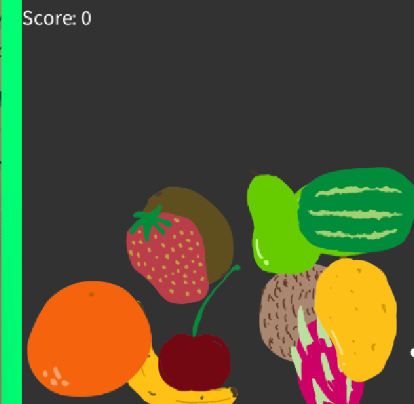
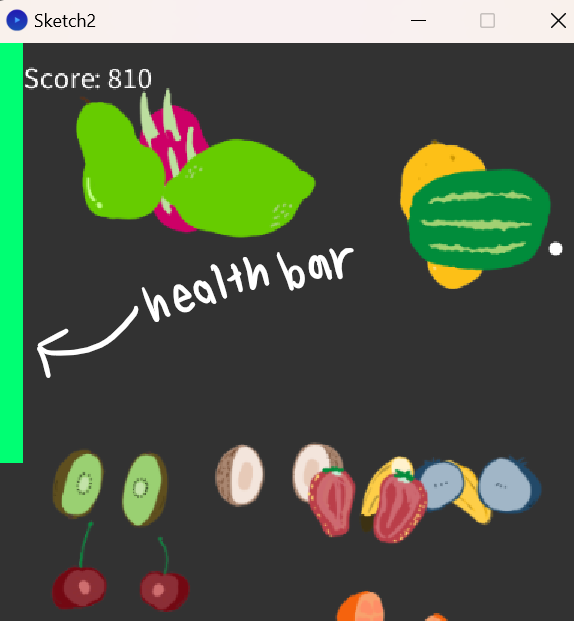
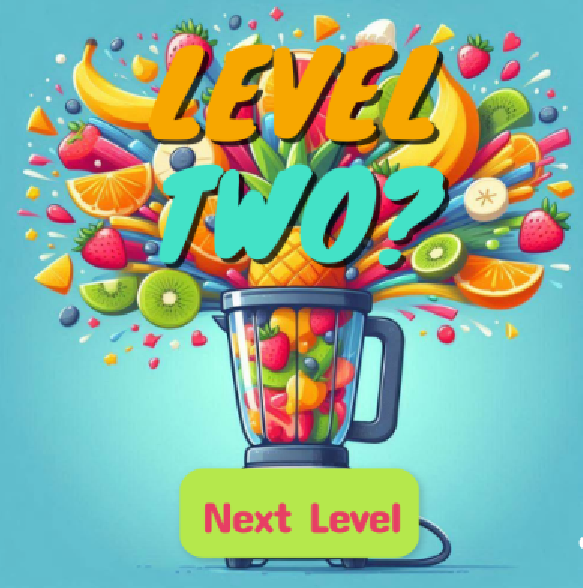
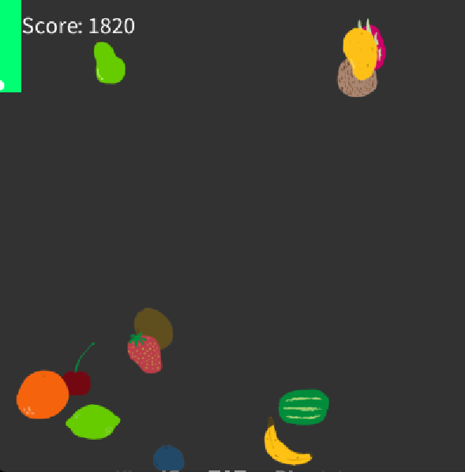
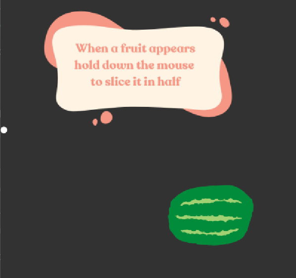

# Splash N Slice

Splash N Slice, players are tasked to slice the fruit before they go off the screen. As the fruits fall down the screen, each cut earns you 10 points. 
 

However, each fruit you miss will make your health bar go down. Once your health bar is gone, the game ends. Your health bar stays the same throughout the game despite there being different levels. While playing, the user utilises the mouse, by left clicking and dragging the mouse across the screen, the trail cuts the fruit. 

Splash N Slice escalates in difficulty throughout the game, through different levels. In order to move to the next level you must reach a certain point threshold. 300 points to level 2, 900 points to level 3, 1800 points to reach level 4, and 2100 points to win the game. 

At each level the fruit sizes decrease and the speed at which they drop increases. This causes the user to need to move faster, and ensure concentration if they want to win.

Before playing, the user will get the opportunity to play in Tutorial mode, which will teach them the basic mechanics of the game and get a feel for what the real game is like. Using textboxes and a reduced version, the user is able to fully understand the mechanics, rules, and a true feel of the game before playing.

